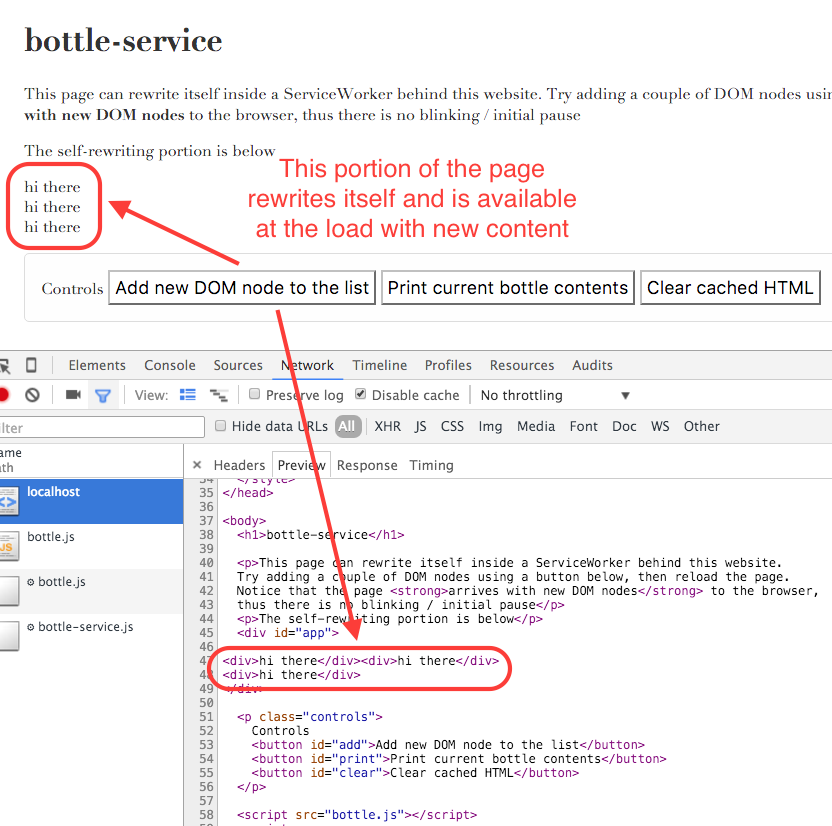

# bottle-service
> Instant web applications restored from ServiceWorker cache

[![NPM][bottle-service-icon] ][bottle-service-url]

[![Build status][bottle-service-ci-image] ][bottle-service-ci-url]
[![semantic-release][semantic-image] ][semantic-url]

[Live demo](https://bottle-service.herokuapp.com/) - might be asleep on Heroku,
wait 10 seconds to start, please use Chrome Desktop for now

[Instant app demo](https://instant-todo.herokuapp.com/) - TodoMVC that is instant on
page reload, also hosted on Heroku, and needs Chrome browser for now



## Browser support

### Chrome 

* Nothing to do, `ServiceWorker` should be enabled by default

### Firefox

* Open `about:config`
* Set the `dom.serviceWorkers.enabled` setting to **true**
* Set the `dom.serviceWorkers.interception.enabled` setting to **true**

## Api

This library attaches itself as `bottleService` object to the 'window'. Every time
you want to store HTML snapshot for an element with id 'myApp', call

```js
// "my-app-name" will be used in the future to allow separate parts of the
// page to be saved separately
// <div id="myApp"> // controlled by the web app </div>
// application has been rendered
bottleService.refill('my-app-name', 'myApp')
```

There are a couple of secondary api calls

```js
bottleService.clear('my-app-name'); // delete whatever is stored in the ServiceWorker cache
bottleService.print('my-app-name'); // prints the stored text to console
```

## Example

See [dist/index.html](dist/index.html) that includes the "application" code.
Every time the user clicks "Add item" button, the application code adds a new DOM node,
then tells the bottle service to store the new snapshot

```js
var applicationName = 'bottle-demo'
document.getElementById('add').addEventListener('click', function () {
  var el = document.getElementById('app')
  var div = document.createElement('div')
  var text = document.createTextNode('hi there')
  div.appendChild(text)
  el.appendChild(div)
  // store HTML snapshot
  bottleService.refill(applicationName, 'app')
})
```

When the page loads, the ServiceWorker will intercept `index.html` and will insert
the saved HTML snapshot into the page before returning it back to the browser for rendering.
Thus there is no page rewriting on load, no flicker, etc.

## Related

* Instant web apps without page flicker or loading screens, 
  [blog post](http://glebbahmutov.com/blog/instant-web-application/), 
  [source repo](https://github.com/bahmutov/instant-vdom-todo)
* Dynamic page rewriting on start [hydrate-vue-todo](https://github.com/bahmutov/hydrate-vue-todo)
* Fast application start from pre-rendered HTML 
  [hydrate-vdom-todo](https://github.com/bahmutov/hydrate-vdom-todo)

## Related projects using ServiceWorkers

* [express-service](https://github.com/bahmutov/express-service) - run ExpressJS server
  inside ServiceWorker
* [service-turtle](https://github.com/bahmutov/service-turtle) - Flexible http request 
  interception using ServiceWorker

### Small print

Author: Gleb Bahmutov &copy; 2015

* [@bahmutov](https://twitter.com/bahmutov)
* [glebbahmutov.com](http://glebbahmutov.com)
* [blog](http://glebbahmutov.com/blog/)

License: MIT - do anything with the code, but don't blame me if it does not work.

Spread the word: tweet, star on github, etc.

Support: if you find any problems with this module, email / tweet /
[open issue](https://github.com/bahmutov/bottle-service/issues) on Github

## MIT License

Copyright (c) 2015 Gleb Bahmutov

Permission is hereby granted, free of charge, to any person
obtaining a copy of this software and associated documentation
files (the "Software"), to deal in the Software without
restriction, including without limitation the rights to use,
copy, modify, merge, publish, distribute, sublicense, and/or sell
copies of the Software, and to permit persons to whom the
Software is furnished to do so, subject to the following
conditions:

The above copyright notice and this permission notice shall be
included in all copies or substantial portions of the Software.

THE SOFTWARE IS PROVIDED "AS IS", WITHOUT WARRANTY OF ANY KIND,
EXPRESS OR IMPLIED, INCLUDING BUT NOT LIMITED TO THE WARRANTIES
OF MERCHANTABILITY, FITNESS FOR A PARTICULAR PURPOSE AND
NONINFRINGEMENT. IN NO EVENT SHALL THE AUTHORS OR COPYRIGHT
HOLDERS BE LIABLE FOR ANY CLAIM, DAMAGES OR OTHER LIABILITY,
WHETHER IN AN ACTION OF CONTRACT, TORT OR OTHERWISE, ARISING
FROM, OUT OF OR IN CONNECTION WITH THE SOFTWARE OR THE USE OR
OTHER DEALINGS IN THE SOFTWARE.

[bottle-service-icon]: https://nodei.co/npm/bottle-service.png?downloads=true
[bottle-service-url]: https://npmjs.org/package/bottle-service
[bottle-service-ci-image]: https://travis-ci.org/bahmutov/bottle-service.png?branch=master
[bottle-service-ci-url]: https://travis-ci.org/bahmutov/bottle-service
[semantic-image]: https://img.shields.io/badge/%20%20%F0%9F%93%A6%F0%9F%9A%80-semantic--release-e10079.svg
[semantic-url]: https://github.com/semantic-release/semantic-release
